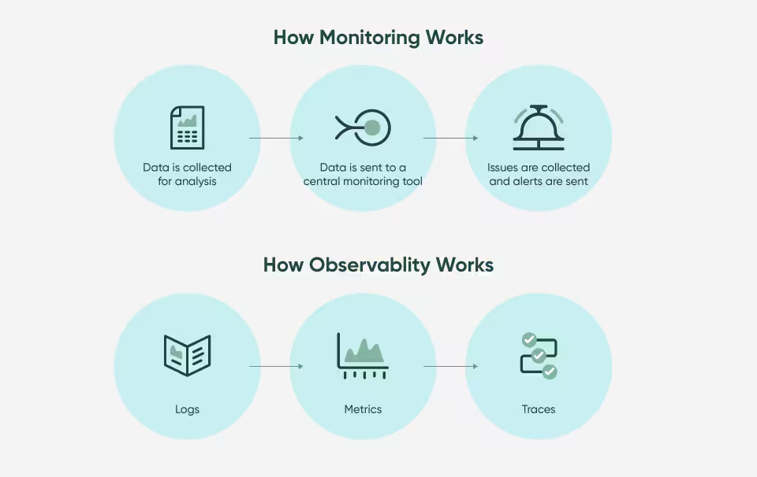
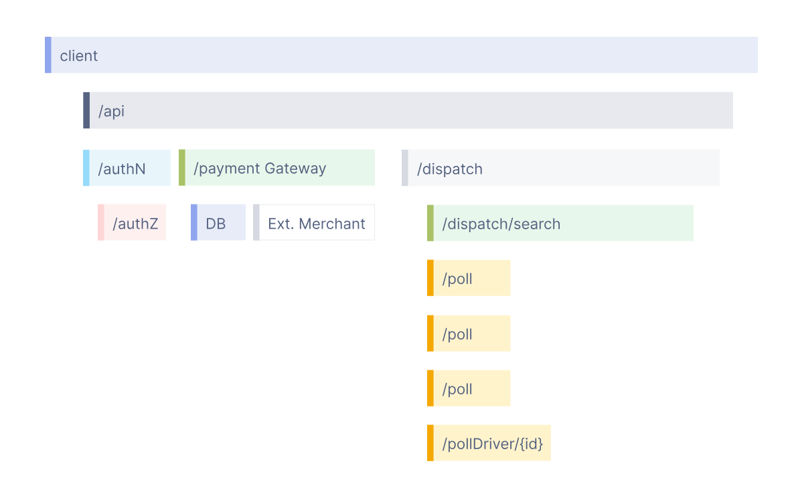
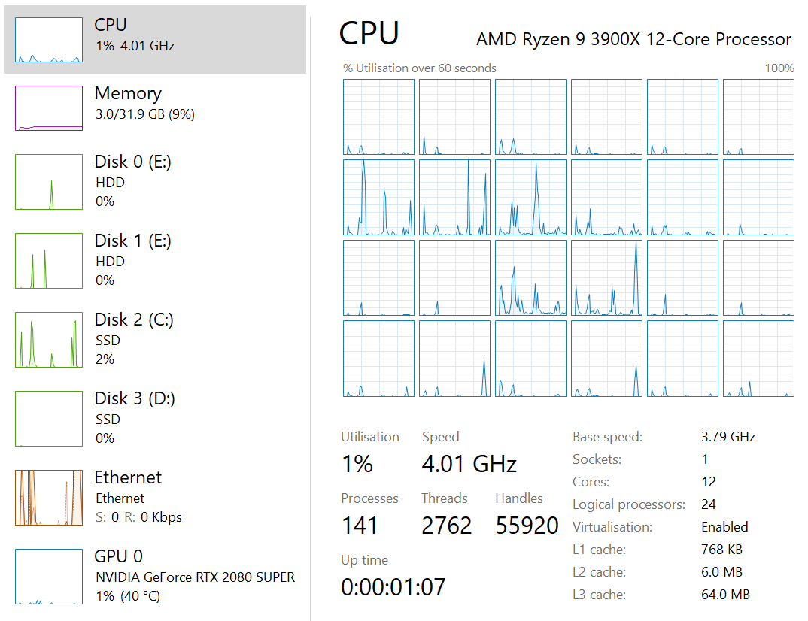
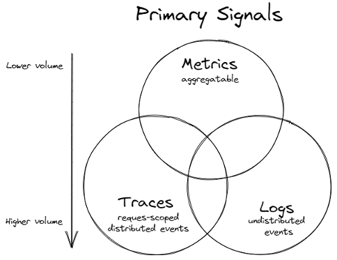
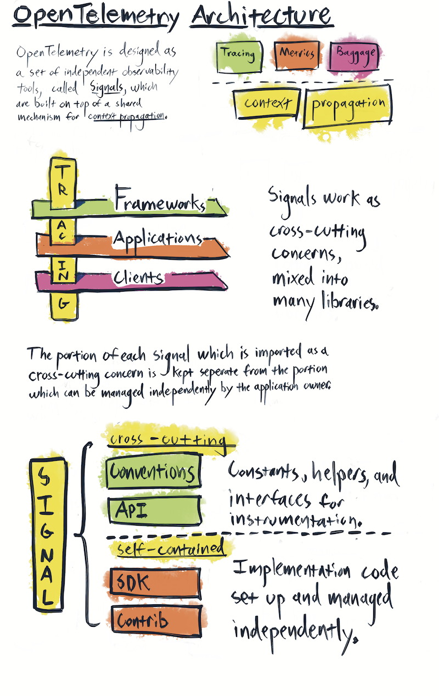
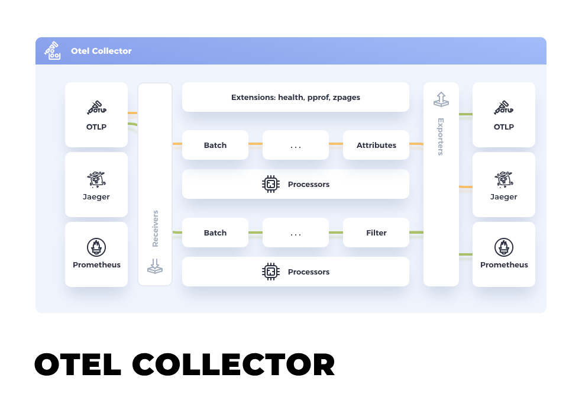

# What are events?

Events are anything that is deemed important for business, security, or troubleshooting reasons and can range from user actions, system errors, configuration changes, security breaches, network traffic, performance metrics, to software updates and service statuses.

Some common examples of events include:

- Completing a batch processing job.
- Triggering scheduled tasks or cron jobs.
- Changes in user permissions or roles.
- Receiving an incoming HTTP request.
- Database transactions like creating, updating, or deleting records.
- Executing a function.
- Registering or authenticating a user.
- Initiating or terminating a background process.
- Writing data to a file.
- Making an HTTP request to some API.

# Observability vs Monitoring


# What problem we have
One of the goals of building highly observable systems is to provide valuable insight into the behavior of the application. Observable systems allow problems to be identified and surfaced through alerts before end users are impacted.

- Logs

``` 
I, [2021-02-23T13:26:23.505892 #22473]  INFO -- : [6459ffe1-ea53-4044-aaa3-bf902868f730] Started GET "/" for ::1 at 2021-02-23 13:26:23 -0800
```

Logs are an historical record of the various events that occur within a software application, system, or network. They are chronologically ordered so that they can provide a comprehensive timeline of activities, errors, and incidents, enabling you to understand what happened, when it happened, and, often, why it happened.
In computing, logging is the act of keeping a log of events that occur in a computer system, such as problems, errors or just information on current operations.
- Tracing


Where logging provides an overview to a discrete, event-triggered log, tracing encompasses a much wider, continuous view of an application. The goal of tracing is to following a program’s flow and data progression.
- Metrics

The purpose of metrics is to inform observers about the health & operations regarding a component or system. A metric represents a point in time measure of a particular source, and data-wise tends to be very small. The compact size allows for efficient collection even at scale in large systems.
- Alert

https://microsoft.github.io/code-with-engineering-playbook/observability/log-vs-metric-vs-trace/



# Python OpenTelemetry




```commandline
pip install opentelemetry-api
pip install opentelemetry-sdk
```

```commandline
pip install opentelemetry-exporter-{exporter}
pip install opentelemetry-instrumentation-{instrumentation}
```


# OpenTelemetry Collector


## Vendor-agnostic way to receive, process and export telemetry data.

``` yml
receivers:
  otlp:
    protocols:
      grpc:
        endpoint: 0.0.0.0:4317
exporters:
  debug:
    verbosity: detailed

  otlphttp:
    endpoint: http://loki:3100/otlp/

  otlp:
    endpoint: jaeger:4317
    tls:
      insecure: true
      insecure_skip_verify: true
  otlp/2:
    endpoint: tempo:4317
    tls:
      insecure: true
      insecure_skip_verify: true

processors:

  batch:

  attributes:
    actions:
      - action: insert
        key: loki.attribute.labels
        value: label, duration, http.method, http.url, http.host, http.client_ip, http.user_agent, http.request_id, http.status_code, iam.user_id

service:
  pipelines:
    traces:
      receivers: [ otlp ]
      exporters: [ otlp, otlp/2]
    logs:
      receivers: [ otlp ]
      processors: [attributes]
      exporters: [ otlphttp ]

```

---

## Sampling

Head Sampling
- Easy to understand
- Easy to configure
- Efficient
- Can be done at any point in the trace collection pipeline

Tail Samplling

--- 

**Context propagation** 

{'traceparent': '00-9c140c07025c90b01f7fb5826fdc39c7-3de357031a99a618-01'}
