# System Observability

<div class='absolute bottom-2 right-3'>
presented by Igor Udot
</div>

<!--
Hello everyone!

Today, I want to talk about \*system observability\*.
If we want to build a robust system in which it is easy to fix errors, it's very important to understand how that system works inside.
-->

---

# Monitoring vs Observability


<!--
I guess a lot of us have heard about \*monitoring\*, so let's compare monitoring and observability.

When we talk about monitoring, we can imagine a black box. We stand outside and see what the system gives us - whether it is alive or already broken, whether it works normally or is overwhelmed. However, we are not allowed to look inside.

On the other hand, we have \*observability\*, which helps us understand why the system works in a certain way. It changes our perspective to a white box, inside which we can observe almost every state of the system.

As a result, we can say that observability gives us a full understanding of the system's behavior, while monitoring simply shows consequences.  There are two questions that help us better understand the main concept.
-->

---
layout: center
class: text-center
mdc: true
---

# "<span v-mark.yellow.circle=1>Is</span> the system working as expected?"

What is monitoring

<!--
You can see this question starts with 'Is,' so it can only be answered in a binary way: \*yes\* or \*no\*.
-->

---
layout: center
class: text-center
mdc: true
---

# "<span v-mark.yellow.circle=1>Why</span> is the system behaving this way?"

What is observability

<!--
But when we see this question\*\*question\*\*. This is a 'why' question our answer will be more infomative.


 So we can see a complete difference here between these two questions.
Let's repeat it again:

 \*monitoring is about \*yes or \*no,

\*observability is about \*why\*
-->

---

# Timeline
https://www.crowdstrike.com/blog/observability-redefined/

- 1960: Observability and Control Theory 
- 2013: The Twitter Observability Team Describes Its Mission
- 2016: The (Four) Pillars of Observability at Twitter
- 2017: The Three Pillars of Observability
- 2018: The Year of Observability
- 2019: Passionate Debate Ensues
- 2020: Observability (Re)defined

Observability is something you either 
<span v-mark.red="1">
implement or you don't.
</span>

<!--
Let's go through the observability timeline.

The definition of observability originates from control theory in the 1960s. At that time, people began to think that if a system lacked observability, it would be difficult to understand why certain events occurred. They started trying to implement it in various ways.

And only as recently as in 2013, observability started gaining momentum in the IT industry, when Twitter established an observability team that outlined its mission.

After a few years, Twitter provided a definition for \*The Four Pillars of Observability\*. Initially, it seemed redundant to have four pillars, so it was eventually reduced to \*The Three Pillars of Observability\*. JUST THREE

Following this, in 2018, there was a hype surrounding it, with every company attempting to implement their toolset for observability.

In 2019, debates about observability as a service (SaaS) began, and in 2020, there was a redefinition. Observability can't be simply implemented as a SaaS; it's closely linked with various aspects of a specific product. If \*there is\*  a generic observability solution it required a lot of customization. 


As a \*result\*, Observability is something you either  \*implement or you don't.*
-->

---

# The Three Pillars of Observability

<div>

Metrics - Traces - Logs

</div>

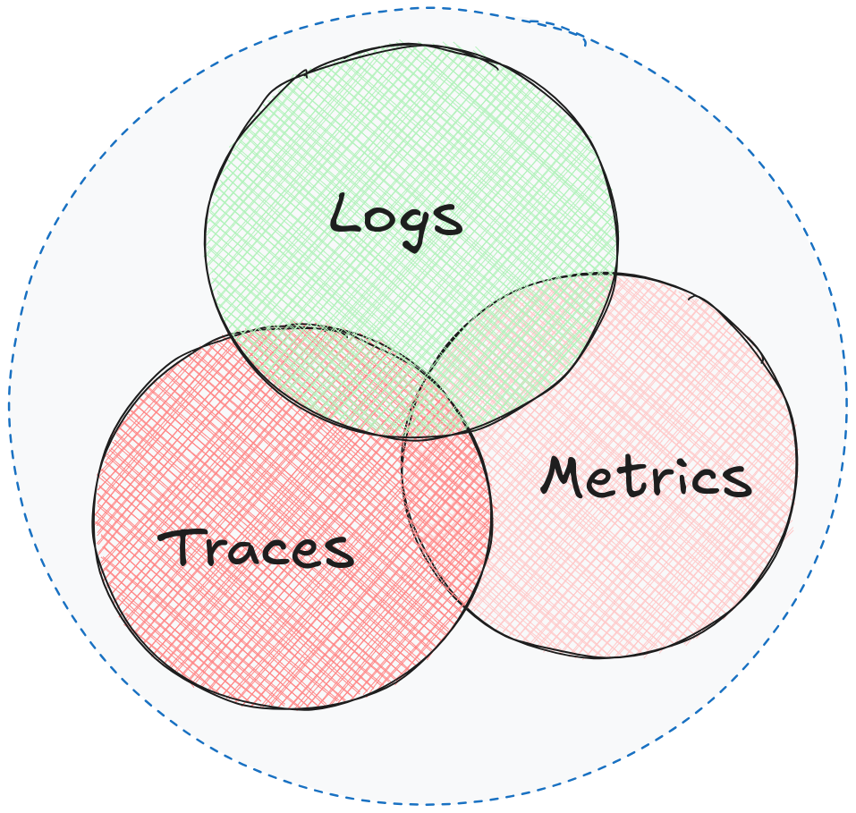

<!--
Here is where every \*journey of observability\* starts. We need to:
- understand what \*metrics\*, \*traces\*, and \*logs\* are,
- how they are connected
- and why they should be connected together.
-->

---

# Metrics
Metrics are a numerical representation of data.

<div v-click.hide>


- Performance metrics
- Resource utilization metrics
- Error rates metrics
- Availability metrics
</div>

<div v-after
  class='absolute top-40 w-200'
>
  
</div>

<!--
Metrics are not just numbers; they are a numerical representation of data. 
Here are a few example categories of metrics:
- Performance metrics
- Resource utilization metrics
- Error metrics

There is an example of metric:

The metric name here is node_cpu_utilization

The value is 99.9.

And \*Dimensions\* are labels that help give the metric some features.
-->

---

# Traces
Traces are records of the paths taken by requests.

<div v-click='[1]' class="text-center absolute left-25 top-60">
Without tracing, finding the root cause of problems in a distributed system can be challenging.
</div>


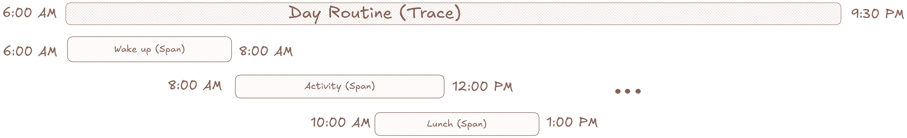

<!--
Here, we need to pay more attention. 

Traces are considered the most important part; 

For \*developers\*, everything starts from traces. Traces help us to connect metrics and logs together.

Slide step 2

Here is usually how it looks, but let's take a simpler example to help us better understand.

Let's imaging we have a company which delivering pizza. 

We have received a pizza order. And start processing the order. The whole process from the point of ordering to the point of delivery to the client is a trace. IS A TRACE

In observability context sub-task inside of a trace is called \*span\*.

Taking the order is the first span.

Cooking the pizza is the second span.

Delivering it is the final span.

Actually, spans can be overlapped and can occur in parallel.

After understanding this example, we might conclude we are actually quite inefficient in pizza ordering because each span takes too much time. 

We need to do the analysis and find ways to optimize the company operation!
-->

---

# Logs
Logs are the historical records of your systems. 

```json
{"level":"info","msg":"Something noteworthy happened!","time":"2019-12-09T16:18:21+01:00"}
{"level":"warning","msg":"You should probably take a look at this.","time":"2019-12-09T16:18:21+01:00"}
{"level":"error","msg":"Something failed but I'm not quitting.","time":"2019-12-09T16:18:21+01:00"}
```

<!--
Logs are the historical records of your system.

When we talk about typical systems, most of them have logs, fewer have tracing, and even fewer have metrics.

After taking an overview of metrics, logs, and traces. We can apply this context to our pizza shop.

-->

---

# Gangs of Four
metrics, logs, trace and pizza
<div v-click=1>
In this context, metrics might include:

- good_review
- time to deliver
</div>
<div v-click=2>
A trace represents the path of a single order.
</div>
<div v-click=3>
For more detailed information, we can refer to the logs.
</div>

<!--
Our Gangs of Four is already here:
- metrics
- logs
- trace
- pizza

Metrics might include
- good_review
- delivery time

A trace represents the path of a single order.

If you still don't have enough 5-star reviews, go to the logs and take a get detailed information.

What does the typical workflow look like for a user of observability?
-->

---
layout: center
---

# User perspective

  <br/>

  Metrics: <span v-mark.yellow="1">indicate</span> there is a problem
  
  Traces: <span v-mark.yellow="1">identify</span> the source of the problem
  
  Logs: <span v-mark.yellow="1">provide</span> the detail which reveals the root cause of the problem

<!--
First, we receive an alert or notification from our metrics.

These metrics indicate that there is a problem.

Next, traces identify the source of the problem.

And logs provide the details that give us the root cause of the problem.

At this point, you may have a question: 'Okay, I have a bunch of information, but how does it work? How is the information connected together?'
-->

---
layout: center
class: text-center
---

There should be <span v-mark.yellow=1>some way</span> to help us correlate metrics, traces, and logs.

<div v-click=2> 

# It is a trace ID.
</div>

<!--
There should be a way to help us correlate metrics, traces, and logs.

This is a trace ID.

I believe we are now ready to leave behind our pizza shop, and move on to the observability of an IT system.
-->

---
class: text-center
---

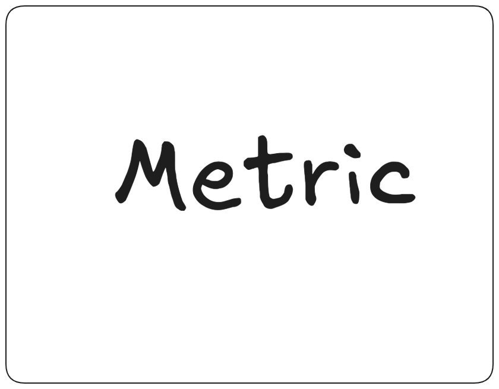

<div v-click=[0] class="absolute top-50 left-60 text-center">

# We got a problem!
Our alert system indicates that the exception count is equal to `1`.
</div>

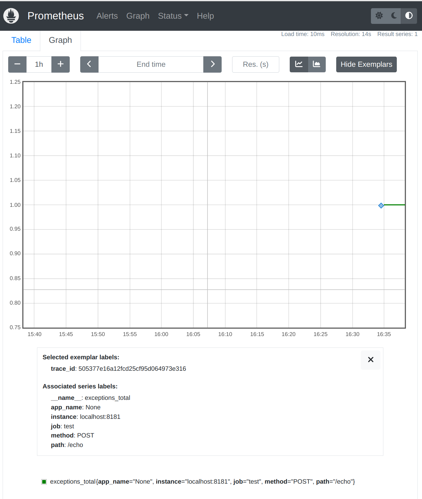

<div v-click=[3] class="absolute top-94 left-34">
<span v-mark.red.circle="3">  There is our trace ID--> </span>
</div>


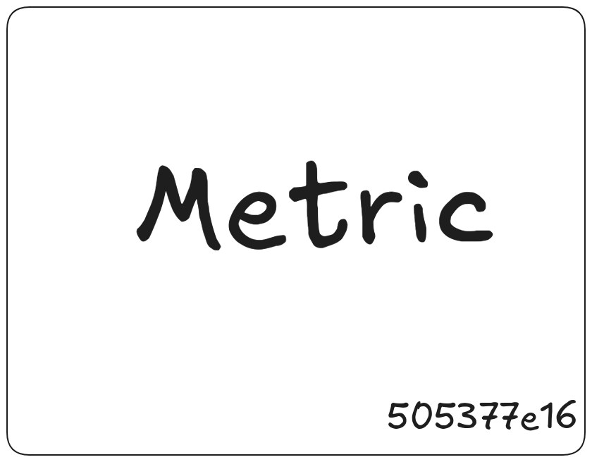

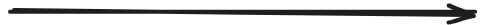

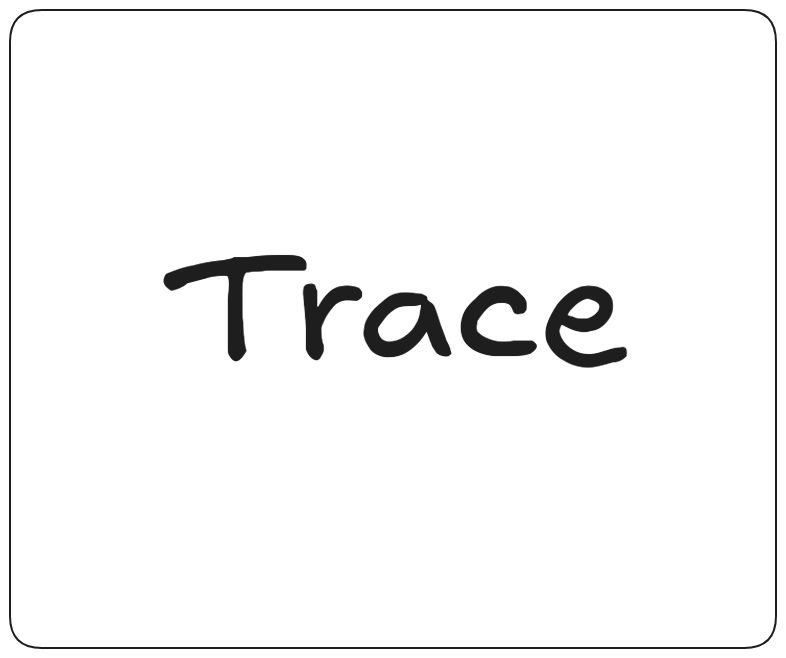


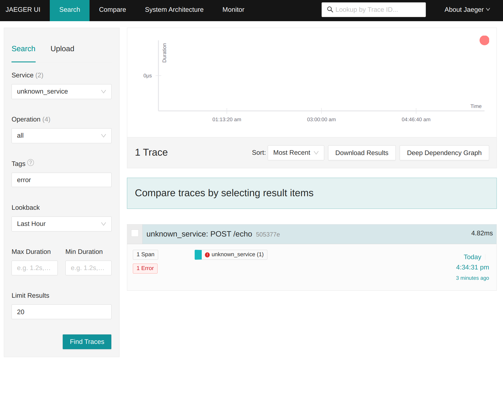


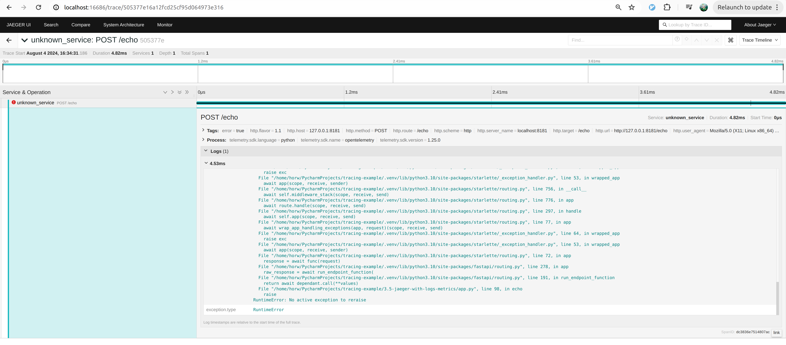

<div v-click=[8] class="absolute top-9 left-100">
<span v-mark.red.circle="8">  <-- There is our trace ID </span>
</div>


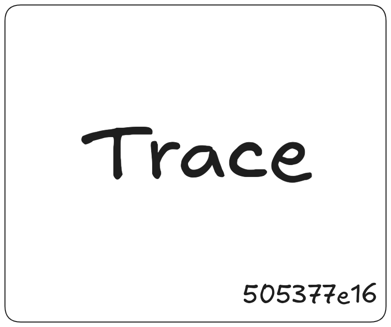


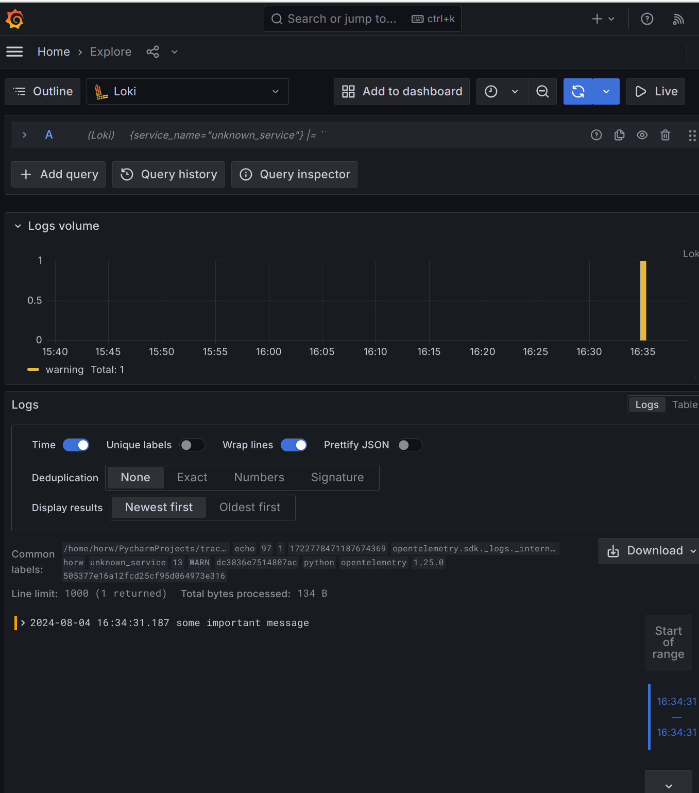
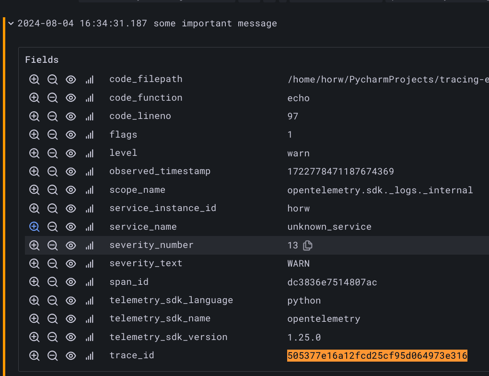
<div v-click=[13] class="absolute bottom-15 right-2">
<span v-mark.red.circle="13"><--  There is our trace ID </span>
</div>

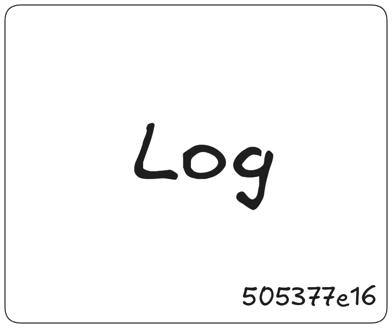


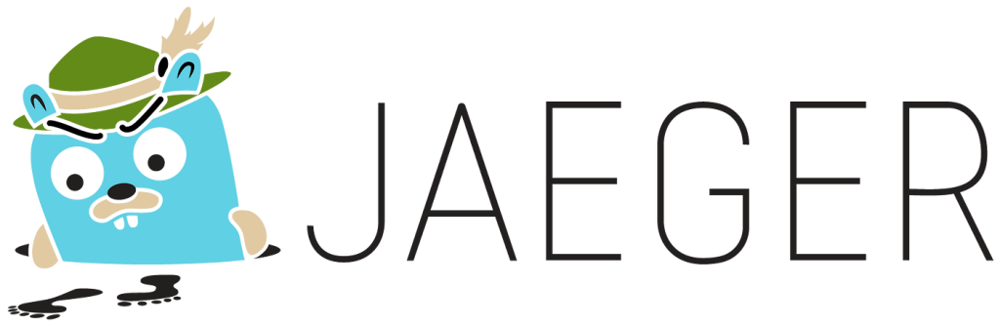


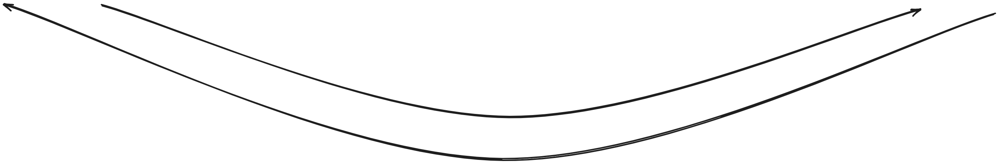


<!--
WE HAVE A PROBLEM

Our alert system\* indicates\* that the exception count is equal to\*1\*.

As users, we move forward by first \*checking the metrics\*. 

We open our \*metrics service\*, look for the \*related metric\*, and find \*the trace ID\*.

With \*this information in hand\*, we move on to the \*trace service\*. Using the \*trace ID\*, we access the tracing system and find helpful information.

However, we \* want to know more details\*. Therefore, we turn to the logs. Opening the \*logs service\*, we once again use our\* trace ID\*. 

Now equipped with \*comprehensive information \* about our exception, we can move forward and fix the error.

In this example, we utilized various observability backends such as Prometheus, Jaeger, and Loki. These tools are\* interchangeable\*, and you can choose any of them based on your preference.

One \*crucial aspect\* is that metrics, traces, and logs are\* interconnected.\* With a trace ID, we have the flexibility to navigate seamlessly between metrics, traces, and logs.

How can \*we assign this trace ID\*, and \*what will help us\*? OpenTelemetry.
-->

---

# OpenTelemery
https://opentelemetry.io/docs/what-is-opentelemetry/

OpenTelemetry is an Observability framework and toolkit designed to <span v-mark.circle.green="1">create</span> and <span v-mark.circle.green="1">manage</span> telemetry data such as <span v-mark.circle.green="1"> traces, metrics, and logs</span>. Crucially, OpenTelemetry is vendor- and tool-agnostic, meaning that it can be used with a broad variety of Observability backends, including open source tools like Jaeger and Prometheus, as well as commercial offerings.

OpenTelemetry<span v-mark.circle.red="2"> is not an observability backend</span> like Jaeger, Prometheus, or other commercial vendors. OpenTelemetry is focused on the generation, collection, management, and export of telemetry. A major goal of OpenTelemetry is that you can easily instrument your applications or systems, no matter their language, infrastructure, or runtime environment. Crucially, the<span v-mark.circle.red="2"> storage and visualization </span>of telemetry is intentionally left to other tools.

<!--
It's a framework that helps us \*create\* and \*manage\* telemetry data. That is what it has been designed for.

What it is not designed for storing and visualisation.

It's not an observability backend like Jaeger or Prometheus.

How it works?
-->

---

# Simple workflow

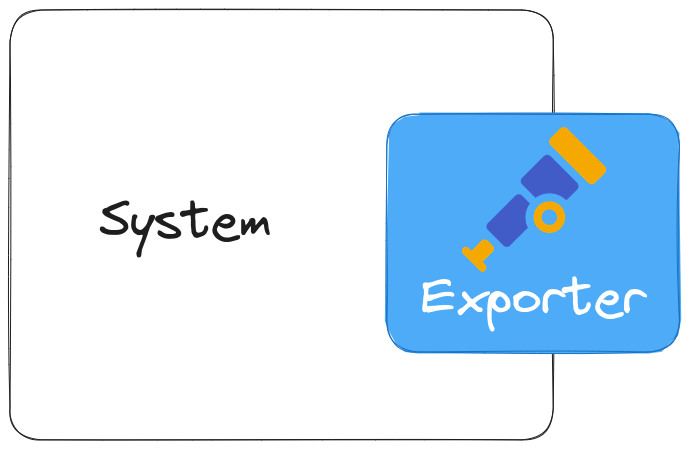
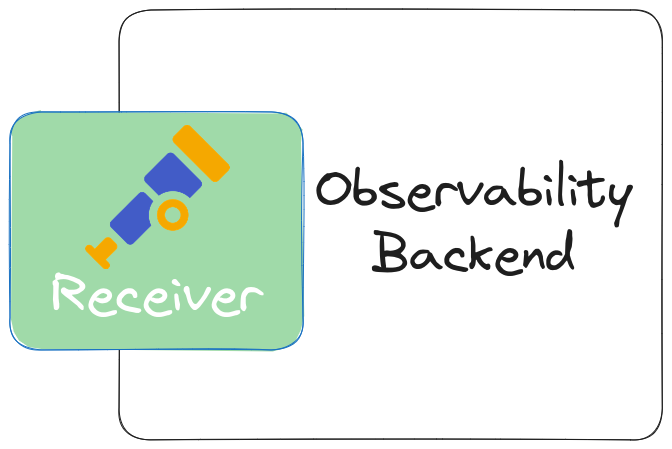
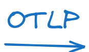

<div v-click="[1,3]" class='absolute top-35 left-65'> <span v-mark="{ at: 1, color: '#1971c2', type: 'circle' }">Exporters</span> help us transfer data to a <span v-mark="{ at: 2, color: '#a0daa9', type: 'circle' }"> data consumers / receivers.</span> </div>
<arrow v-click="[1,3]" x1="390" y1="170" x2="390" y2="220" color="#1971c2" width="2" arrowSize="3" />
<arrow v-click="[2]" x1="610" y1="170" x2="610" y2="220" color="#a0daa9" width="2" arrowSize="3" />


<div v-click="[3]" class='absolute top-35 left-40'> And ideally, it's supposed to use the OTLP(Opentelemetry protocol) for communication. </div>

<arrow v-click="[3]" x1="490" y1="180" x2="490" y2="220" color="#1971c2" width="2" arrowSize="3" />


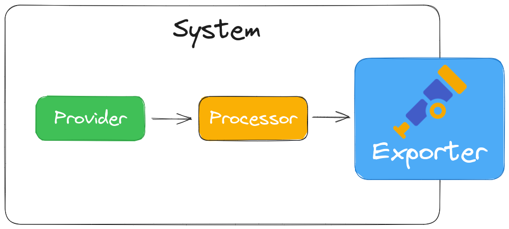
<arrow v-click="[5]" x1="290" y1="170" x2="290" y2="200" color="#953" width="2" arrowSize="3" />
<div v-click="[5]" class='absolute top-30 left-50'> We should instrument our system <br/> to make it possible to send OTLP.</div>


<style>
.bg {
  transition: opacity 1200ms ease;
  background-color: white;
}
</style>
<div v-click="[6,11]" class='absolute top-40 w-220 h-200 bg'>
<div class="bg">

````md magic-move {at:7, lines: true}

```python
# tracing
resource = Resource.create(attributes={ #            <-- Labels for recognizing service.
    "service.name": app_name,
})

exporter = OTLPSpanExporter(endpoint=endpoint) #                                  <-- Exporter
processor = BatchSpanProcessor(exporter) #                                        <-- Processor

provider = TracerProvider(active_span_processor=processor, resource=resource) #   <-- Provider
set_tracer_provider(provider)
```
```python
# metrics
resource = Resource.create(attributes={ #            <-- Labels for recognizing service.
    "service.name": app_name,
})
exporter = OTLPMetricExporter(insecure=True) #                                    <-- Exporter
reader = PeriodicExportingMetricReader(exporter, math.inf) #                      <-- Processor

provider = MeterProvider(metric_readers=[reader], resource=resource) #            <-- Provider
set_meter_provider(provider)
```
```python
# logs 
resource = Resource.create(attributes={ #            <-- Labels for recognizing service.
    "service.name": app_name,
})

exporter = OTLPLogExporter(insecure=True) #                                          <-- Exporter
processor = BatchLogRecordProcessor(exporter) #                                      <-- Processor

provider = LoggerProvider(multi_log_record_processor=processor, resource=resource) # <-- Provider
set_logger_provider(provider)

handler = LoggingHandler(level=logging.NOTSET, logger_provider=provider)
# Attach OTLP handler to root logger
logging.getLogger().addHandler(handler)
```
```python
# BUT you can also add a custom logs processor to your code.
def add_open_telemetry_spans(_, __, event_dict) -> dict:
    span = trace.get_current_span() # <-- get span(context) object 
    if not span.is_recording():
        event_dict["span"] = None
        return event_dict

    ctx = span.get_span_context() #   <-- get span(context) attribute
    parent = getattr(span, "parent", None)

    event_dict["span"] = { #          <-- set this context to the logger 
        "span_id": hex(ctx.span_id),
        "trace_id": hex(ctx.trace_id),
        "parent_span_id": None if not parent else hex(parent.span_id),
    }

    return event_dict
```
```python
# instrument libs
LoggingInstrumentor().instrument(set_logging_format=True)
HTTPXClientInstrumentor().instrument()
...
FastAPIInstrumentor.instrument_app(app, tracer_provider=tracer)
```
````

</div>
</div>

<!--
Here we have two blocks:
- Our System
- Observability backend

As you see our system has the exporter. We integration it into the our system, how we do it, will be discussed later.

Exporters help us transfer data to data consumers/receivers.

Ideally, it's supposed to use the OpenTelemetry protocol, abbreviated as OTLP, for communication.

When we implement observability for the system, apart from exporter, we also need to add two more blocks inside:
- Provider
- Processor

Of  course Provider, processor, exporter are not parts of out actual system, we only integrate them into the system to enable observability. The system still needs to perform its functions and then provide helpful information to the provider. Giving **helpful** information to the provider is essential for achieving observability.

We can provide helpful information to the provider only after \*we instrument our system\* to collect and send telemetry data. 

In this example, I used Python, and all these functions are from the OpenTelemetry library. As we can observe, we declare a provider, processor, and executor for tracing, as well as for metrics and logs.

If you want to customize something, you can use trace context to add additional information. 

Alternatively, if you don't, you can directly use box solutions.
-->

---

# Medium workflow
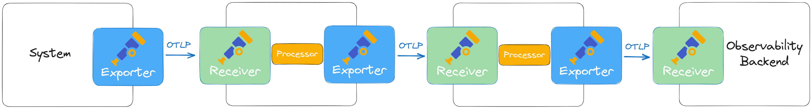
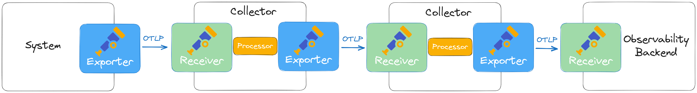
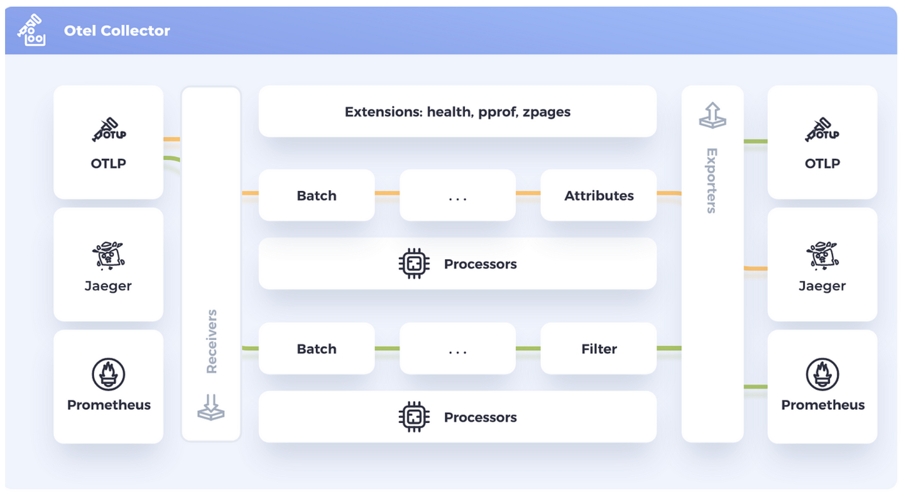
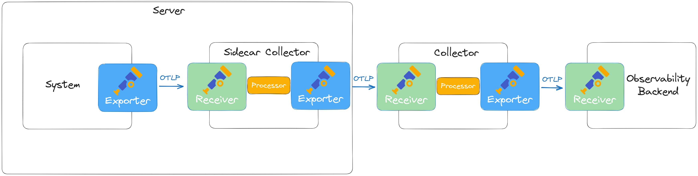

<!--
Our system is growing. 
It has now become a chain of blocks, with something new in the middle. 
These are collectors.

Collectors perform the same tasks: they receive, process, and export data.  We can add additional logic to them, like filtering, batching. You can send data in batches to reduce network load.A collector serves as our gateway to access the observability backend.

Here you can see two collectors, it will be clear why soon.

We can modify this architecture. Logically, nothing changes, but there are physical implications. Our server needs to send data, and the network is usually not our best friend due to network latency. Therefore, we can place our System and Collector as a Sidecar on one physical server. This way, our System doesn't need to worry as much about data transfer; let the Collector handle it.

Workflows are not always as straightforward as in this example.
-->

---

# Complex workflow

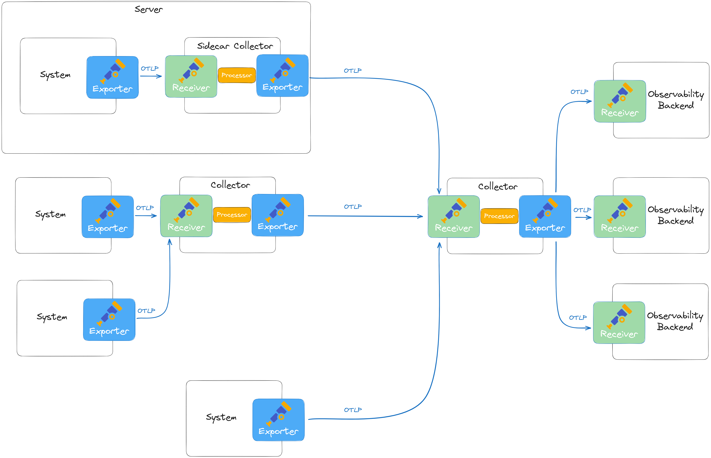

<!--
Usually, we have many more elements.
The Collector can also help us gather data from different sources.

- The example at the top assumes that, as we already know from the previous slide, there is low network latency for our system, because we attached a sidecar collector.
- In the middle example, information can be merge first before being sent further. Merge can help us to sync data or combine it. 
- The bottom example is a straightforward connection to our master collector.  When latency is not issue for us.


Our master collector can send data to different observability backends.

In these few slides, we have become familiar with the possible observability workflows.

One more thing that needs to be mentioned is data.
I have mentioned data transfer numerous times. Therefore, when we experience high loads, we also need to consider how we filter data. And it can be achieved with sampling.  

Data filtering. Data sampling.
-->

---

# Sampling
https://opentelemetry.io/docs/concepts/sampling/


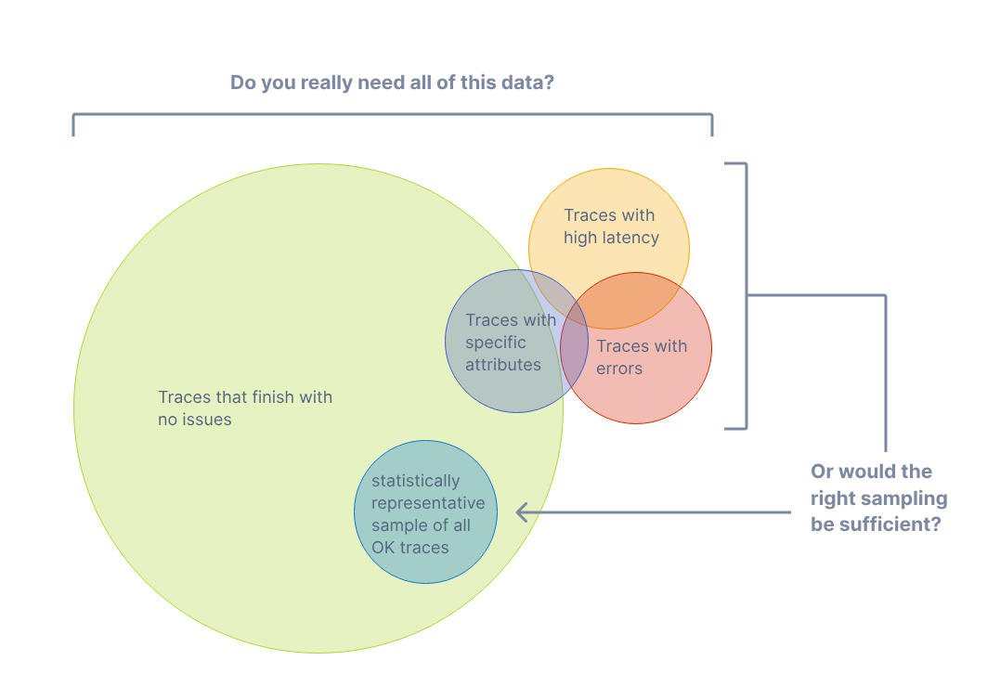

<!--
Here are our collectors and data flow, represented as a trace. 

Do you really need all of this data? 
The biggest green circle represents successful traces, 
the red circle indicates where errors occurred, 
and the yellow circle shows warnings.
 
Perhaps we are only interested in specific traces. For some trivial traces, we want to filter them and focus on only a small samples. 

Sampling helps us achieve this.
-->

---

# Head Sampling 

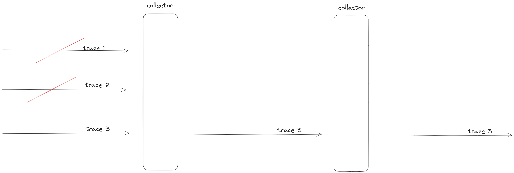
<div v-click=2 class='absolute top-100 left-45 w-150' >

-  Easy to understand
-  Easy to configure
- Efficient
- Can be done at any point in the trace collection pipeline

</div>

<!--
There are two ways to do sampling:
- Head Sampling and Tail

Head sampling is quite simple; you just sample trace flow from the incoming data, In other words head sampling.  


However, you may not always know whether a sampled trace is good or bad.

It's just a random.
-->

---

# Tail Sampling

<div v-click=[1] class='absolute top-60 left-35 w-180' >
Tail Sampling gives you the option to sample your traces <span v-mark.yellow=1>based on specific criteria</span> derived <span v-mark.yellow=1>from different parts</span> of a trace, which isn’t an option with Head Sampling.
</div>
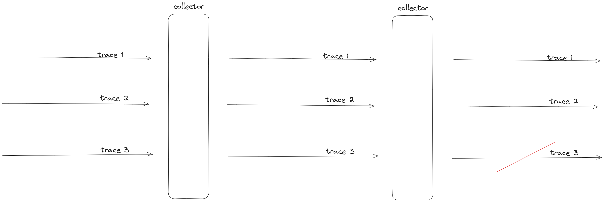

<div v-click=[3] class='absolute top-100 left-45 w-150' >


- Always sampling traces that contain an error
- Sampling traces based on overall latency
- Sampling more traces originating from a newly deployed service

</div>
<div v-click=4 class='absolute top-100 left-45 w-150' >
But

- Tail sampling can be difficult to implement. 
- Tail sampling can be difficult to operate. 

</div>

<!--
Tail sampling is much representative. 

click*

It gives you the option to sample your traces based on specific criteria derived from different parts of a trace, which isn't an option with Head Sampling.

In tail sampling, sampling occurs on processed data, after full information has been gathered, and only then do we consider whether to sample it or not. In other words - tail sampling.

For example, we can sample traces based on the following criteria:

- Traces with errors
- Traces with overall latency
- Traces from newly deployed services

But tail sampling can be expensive, as well as difficult to implement and operate
-->

---
layout: center
---

# Demo

---

# Conclusion

<div v-click=0 class='absolute top-50 left-35 w-150' >

<v-clicks>

- What is observability
- Three pillars of observability
- Observability workflow
- Instrument
- Data sampling

</v-clicks>
</div>

<!--
Today we look into 

- what system observability is, 
- seen its three pillars
- review the observability workflows
- went through instruments 
- and touched on data sampling as a way to optimise the performance of the observability system.
-->
