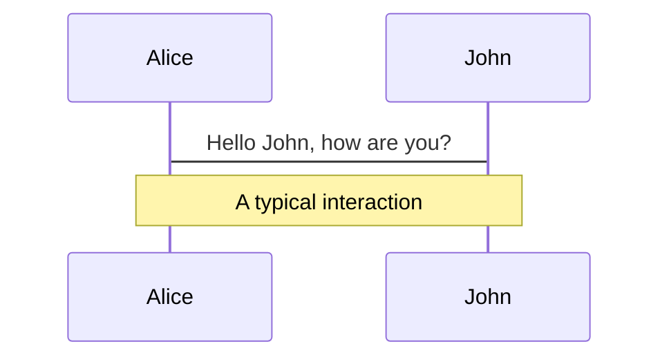
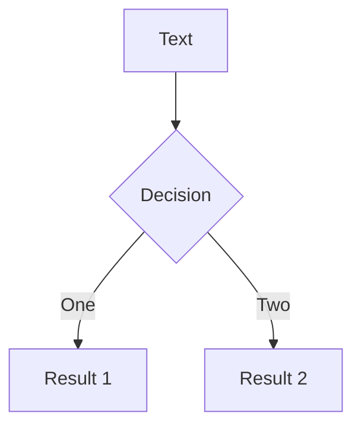
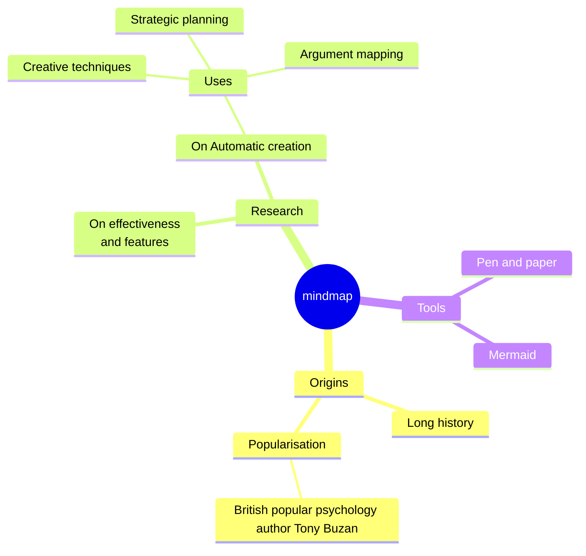
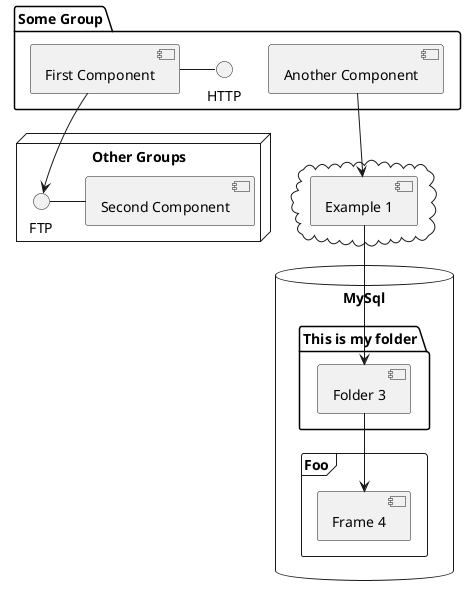

# Services Observability

<div class='absolute bottom-2 right-3'>
presented by Igor Udot
</div>
---
layout: center
class: text-center
mdc: true
---


# "Why is the system behaving this way?"

What is observability

---

# Timeline
https://www.crowdstrike.com/blog/observability-redefined/

- 1960: Observability and Control Theory 
- 2013: The Twitter Observability Team Describes Its Mission
- 2016: The (Four) Pillars of Observability at Twitter
- 2017: The Three Pillars of Observability
- 2018: The Year of Observability
- 2019: Passionate Debate Ensues
- 2020: Observability (Re)defined

Observability is something you 
<span v-mark.red="1">
either have, or you don’t.
</span>


---
layout: center 
---

# The Three Pillars of Observability

<div>

Metrics - Logs - Tracing

</div>


---

# Metrics
Metrics are a numerical representation of data.

<div v-click.hide>


- Performance metrics
- Resource utilization metrics
- Error rates metrics
- Availability metrics
</div>

<div v-after
  class='absolute top-40 w-200'
>
  
</div>
---

# Logs
Log files are the historical records of your systems. 


````md magic-move {lines: true}
```json
{"level":"info","msg":"Something noteworthy happened!","time":"2019-12-09T16:18:21+01:00"}
{"level":"warning","msg":"You should probably take a look at this.","time":"2019-12-09T16:18:21+01:00"}
{"level":"error","msg":"Something failed but I'm not quitting.","time":"2019-12-09T16:18:21+01:00"}
```

```md
A simple print statement such as `Hello, I reached here` can help in debugging a lot at times...
```
````

---

# Traces
Records the paths taken by requests.

Without tracing, finding the root cause of performance problems in a distributed system can be challenging.


---
layout: center
---


  <br/>

  Metrics: <span v-mark.yellow="1">indicate</span> there is a problem
  
  Traces: <span v-mark.yellow="1">identify</span> the source of the problem
  
  Logs: <span v-mark.yellow="1">provide</span> the detail which reveals the root cause of the problem

---

# OpenTelemery
https://opentelemetry.io/docs/what-is-opentelemetry/

OpenTelemetry is an Observability framework and toolkit designed to <span v-mark.circle.green="1">create</span> and <span v-mark.circle.green="1">manage</span> telemetry data such as <span v-mark.circle.green="1"> traces, metrics, and logs</span>. Crucially, OpenTelemetry is vendor- and tool-agnostic, meaning that it can be used with a broad variety of Observability backends, including open source tools like Jaeger and Prometheus, as well as commercial offerings.

OpenTelemetry<span v-mark.circle.red="2"> is not an observability backend</span> like Jaeger, Prometheus, or other commercial vendors. OpenTelemetry is focused on the generation, collection, management, and export of telemetry. A major goal of OpenTelemetry is that you can easily instrument your applications or systems, no matter their language, infrastructure, or runtime environment. Crucially, the<span v-mark.circle.red="2"> storage and visualization </span>of telemetry is intentionally left to other tools.
---

# Workflow example


<arrow v-click="[1]" x1="140" y1="220" x2="140" y2="270" color="#953" width="2" arrowSize="3" />
<div v-click="[1]" class='absolute top-40 left-20'> We can instrument our app <br/> to make it possible to send OTLP.</div>
<arrow v-click="[2]" x1="290" y1="220" x2="290" y2="270" color="#953" width="2" arrowSize="3" />
<arrow v-click="[2]" x1="530" y1="220" x2="530" y2="270" color="#953" width="2" arrowSize="3" />

<div v-click="[2]" class='absolute top-45 left-45'> Exporters help us transfer data to data consumers / receivers. </div>

---

# OpenTelemetry Collector


<arrow v-click="1" x1="290" y1="120" x2="290" y2="160" color="#953" width="2" arrowSize="3" />
<arrow v-click="2" x1="500" y1="120" x2="500" y2="285" color="#953" width="2" arrowSize="3" />
<arrow v-click="3" x1="700" y1="120" x2="700" y2="160" color="#953" width="2" arrowSize="3" />
---

# OpenTelemetry Protocol
https://opentelemetry.io/docs/specs/otlp/<br/>

The OpenTelemetry Protocol (OTLP) specification describes the encoding, transport, and delivery mechanism of telemetry data between telemetry sources, intermediate nodes such as collectors and telemetry backends.

<arrow v-click="1" x1="350" y1="210" x2="350" y2="280" color="#953" width="2" arrowSize="3" />
<arrow v-click="1" x1="610" y1="210" x2="610" y2="280" color="#953" width="2" arrowSize="3" />


---

# Example


---


# What is Slidev?

Slidev is a slides maker and presenter designedfor developers, consist of the following features

- 📝 **Text-based** - focus on the content with Markdown, and then style them later
- 🎨 **Themable** - themes can be shared and re-used as npm packages
- 🧑‍💻 **Developer Friendly** - code highlighting, live coding with autocompletion
- 🤹 **Interactive** - embed Vue components to enhance your expressions
- 🎥 **Recording** - built-in recording and camera view
- 📤 **Portable** - export to PDF, PPTX, PNGs, or even a hostable SPA
- 🛠 **Hackable** - virtually anything that's possible on a webpage is possible in Slidev
<br>
<br>

Read more about [Why Slidev?](https://sli.dev/guide/why)

<!--
You can have `style` tag in markdown to override the style for the current page.
Learn more: https://sli.dev/features/slide-scope-style
-->

<style>
h1 {
  background-color: #2B90B6;
  background-image: linear-gradient(45deg, #4EC5D4 10%, #146b8c 20%);
  background-size: 100%;
  -webkit-background-clip: text;
  -moz-background-clip: text;
  -webkit-text-fill-color: transparent;
  -moz-text-fill-color: transparent;
}
</style>

<!--
Here is another comment.
--><!--
The last comment block of each slide will be treated as slide notes. It will be visible and editable in Presenter Mode along with the slide. [Read more in the docs](https://sli.dev/guide/syntax.html#notes)
-->


---
transition: slide-up
level: 2
---

# Navigation

Hover on the bottom-left corner to see the navigation's controls panel, [learn more](https://sli.dev/guide/navigation.html)

## Keyboard Shortcuts

|     |     |
| --- | --- |
| <kbd>right</kbd> / <kbd>space</kbd>| next animation or slide |
| <kbd>left</kbd>  / <kbd>shift</kbd><kbd>space</kbd> | previous animation or slide |
| <kbd>up</kbd> | previous slide |
| <kbd>down</kbd> | next slide |

<!-- https://sli.dev/guide/animations.html#click-animation -->

<p v-after class="absolute bottom-23 left-45 opacity-30 transform -rotate-10">Here!</p>

---
layout: two-cols
layoutClass: gap-16
---

# Table of contents

You can use the `Toc` component to generate a table of contents for your slides:

```html
<Toc minDepth="1" maxDepth="1"></Toc>
```

The title will be inferred from your slide content, or you can override it with `title` and `level` in your frontmatter.

::right::

<Toc v-click minDepth="1" maxDepth="2"></Toc>

---
layout: image-right
image: https://cover.sli.dev
---

# Code

Use code snippets and get the highlighting directly, and even types hover![^1]

```ts {all|5|7|7-8|10|all} twoslash
// TwoSlash enables TypeScript hover information
// and errors in markdown code blocks
// More at https://shiki.style/packages/twoslash

import { computed, ref } from 'vue'

const count = ref(0)
const doubled = computed(() => count.value * 2)

doubled.value = 2
```

<arrow v-click="[4, 5]" x1="350" y1="310" x2="195" y2="334" color="#953" width="2" arrowSize="1" />

<!-- This allow you to embed external code blocks -->
<<< @/snippets/external.ts#snippet

<!-- Footer -->
[^1]: [Learn More](https://sli.dev/guide/line-highlighting)

<!-- Inline style -->
<style>
.footnotes-sep {
  @apply mt-5 opacity-10;
}
.footnotes {
  @apply text-sm opacity-75;
}
.footnote-backref {
  display: none;
}
</style>

<!--
Notes can also sync with clicks

[click] This will be highlighted after the first click

[click] Highlighted with `count = ref(0)`

[click:3] Last click (skip two clicks)
-->

---
level: 2
---

# Shiki Magic Move

Powered by [shiki-magic-move](https://shiki-magic-move.netlify.app/), Slidev supports animations across multiple code snippets.

Add multiple code blocks and wrap them with <code>````md magic-move</code> (four backticks) to enable the magic move. For example:

````md magic-move {lines: true}
```ts {*|2|*}
// step 1
const author = reactive({
  name: 'John Doe',
  books: [
    'Vue 2 - Advanced Guide',
    'Vue 3 - Basic Guide',
    'Vue 4 - The Mystery'
  ]
})
```

```ts {*|1-2|3-4|3-4,8}
// step 2
export default {
  data() {
    return {
      author: {
        name: 'John Doe',
        books: [
          'Vue 2 - Advanced Guide',
          'Vue 3 - Basic Guide',
          'Vue 4 - The Mystery'
        ]
      }
    }
  }
}
```

```ts
// step 3
export default {
  data: () => ({
    author: {
      name: 'John Doe',
      books: [
        'Vue 2 - Advanced Guide',
        'Vue 3 - Basic Guide',
        'Vue 4 - The Mystery'
      ]
    }
  })
}
```

Non-code blocks are ignored.

```vue
<!-- step 4 -->
<script setup>
const author = {
  name: 'John Doe',
  books: [
    'Vue 2 - Advanced Guide',
    'Vue 3 - Basic Guide',
    'Vue 4 - The Mystery'
  ]
}
</script>
```
````

---

# Components

<div grid="~ cols-2 gap-4">
<div>

You can use Vue components directly inside your slides.

We have provided a few built-in components like `<Tweet/>` and `<Youtube/>` that you can use directly. And adding your custom components is also super easy.

```html
<Counter :count="10" />
```

<!-- ./components/Counter.vue -->
<Counter :count="10" m="t-4" />

Check out [the guides](https://sli.dev/builtin/components.html) for more.

</div>
<div>

```html
<Tweet id="1390115482657726468" />
```

<Tweet id="1390115482657726468" scale="0.65" />

</div>
</div>

<!--
Presenter note with **bold**, *italic*, and ~~striked~~ text.

Also, HTML elements are valid:
<div class="flex w-full">
  <span style="flex-grow: 1;">Left content</span>
  <span>Right content</span>
</div>
-->

---
class: px-20
---

# Themes

Slidev comes with powerful theming support. Themes can provide styles, layouts, components, or even configurations for tools. Switching between themes by just **one edit** in your frontmatter:

<div grid="~ cols-2 gap-2" m="t-2">

```yaml
---
theme: default
---
```

```yaml
---
theme: seriph
---
```


</div>

Read more about [How to use a theme](https://sli.dev/themes/use.html) and
check out the [Awesome Themes Gallery](https://sli.dev/themes/gallery.html).

---

# Clicks Animations

You can add `v-click` to elements to add a click animation.

<div v-click>

This shows up when you click the slide:

```html
<div v-click>This shows up when you click the slide.</div>
```

</div>

<br>

<v-click>

The <span v-mark.red="3"><code>v-mark</code> directive</span>
also allows you to add
<span v-mark.circle.orange="4">inline marks</span>
, powered by [Rough Notation](https://roughnotation.com/):

```html
<span v-mark.underline.orange>inline markers</span>
```

</v-click>

<div mt-20 v-click>

[Learn More](https://sli.dev/guide/animations#click-animation)

</div>

---

# Motions

Motion animations are powered by [@vueuse/motion](https://motion.vueuse.org/), triggered by `v-motion` directive.

```html
<div
  v-motion
  :initial="{ x: -80 }"
  :enter="{ x: 0 }"
  :click-3="{ x: 80 }"
  :leave="{ x: 1000 }"
>
  Slidev
</div>
```

<div class="w-60 relative">
  <div class="relative w-40 h-40">
    
    
    
  </div>

  <div
    class="text-5xl absolute top-14 left-40 text-[#2B90B6] -z-1"
    v-motion
    :initial="{ x: -80, opacity: 0}"
    :enter="{ x: 0, opacity: 1, transition: { delay: 2000, duration: 1000 } }">
    Slidev
  </div>
</div>

<!-- vue script setup scripts can be directly used in markdown, and will only affects current page -->
<script setup lang="ts">
const final = {
  x: 0,
  y: 0,
  rotate: 0,
  scale: 1,
  transition: {
    type: 'spring',
    damping: 10,
    stiffness: 20,
    mass: 2
  }
}
</script>

<div
  v-motion
  :initial="{ x:35, y: 30, opacity: 0}"
  :enter="{ y: 0, opacity: 1, transition: { delay: 3500 } }">

[Learn More](https://sli.dev/guide/animations.html#motion)

</div>

---

# LaTeX

LaTeX is supported out-of-box. Powered by [KaTeX](https://katex.org/).

<div h-3 />

Inline $\sqrt{3x-1}+(1+x)^2$

Block
$$ {1|3|all}
\begin{aligned}
\nabla \cdot \vec{E} &= \frac{\rho}{\varepsilon_0} \\
\nabla \cdot \vec{B} &= 0 \\
\nabla \times \vec{E} &= -\frac{\partial\vec{B}}{\partial t} \\
\nabla \times \vec{B} &= \mu_0\vec{J} + \mu_0\varepsilon_0\frac{\partial\vec{E}}{\partial t}
\end{aligned}
$$

[Learn more](https://sli.dev/features/latex)

---

# Diagrams

You can create diagrams / graphs from textual descriptions, directly in your Markdown.

<div class="grid grid-cols-4 gap-5 pt-4 -mb-6">









</div>

Learn More: [Mermaid Diagrams](https://sli.dev/guide/features/mermaid) and [PlantUML Diagrams](https://sli.dev/guide/features/plantuml)

---
foo: bar
dragPos:
  square: -32,0,0,0
---

# Draggable Elements

Double-click on the draggable elements to edit their positions.

<br>

###### Directive Usage

```md

```

<br>

###### Component Usage

```md
<v-drag text-3xl>
  <carbon:arrow-up />
  Use the `v-drag` component to have a draggable container!
</v-drag>
```

<v-drag pos="663,206,261,_,-15">
  <div text-center text-3xl border border-main rounded>
    Double-click me!
  </div>
</v-drag>


###### Draggable Arrow

```md
<v-drag-arrow two-way />
```

<v-drag-arrow pos="67,452,253,46" two-way op70 />

---
src: ./pages/imported-slides.md
hide: false
---

---

# Monaco Editor

Slidev provides built-in Monaco Editor support.

Add `{monaco}` to the code block to turn it into an editor:

```ts {monaco}
import { ref } from 'vue'
import { emptyArray } from './external'

const arr = ref(emptyArray(10))
```

Use `{monaco-run}` to create an editor that can execute the code directly in the slide:

```ts {monaco-run}
import { version } from 'vue'
import { emptyArray, sayHello } from './external'

sayHello()
console.log(`vue ${version}`)
console.log(emptyArray<number>(10).reduce(fib => [...fib, fib.at(-1)! + fib.at(-2)!], [1, 1]))
```

---
layout: center
class: text-center
---

# Learn More

[Documentation](https://sli.dev) · [GitHub](https://github.com/slidevjs/slidev) · [Showcases](https://sli.dev/showcases.html)

<PoweredBySlidev mt-10 />
